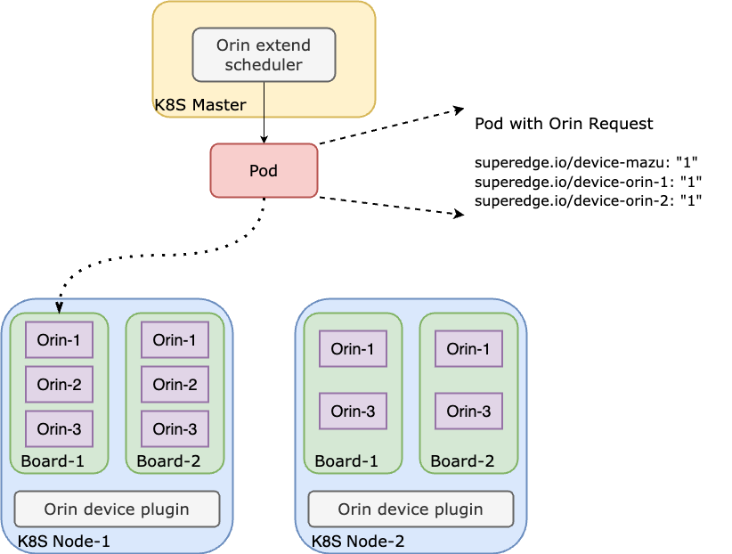

# Orin Device System

## About Project

The Orin system-level chip is the latest generation of automotive autonomous driving intelligent chips released by NVIDIA in 2019. Typically, for common scenarios, devices like Orin can be integrated into a Kubernetes cluster using the device-plugin mechanism, providing edge computing power support for workloads. However, when multiple Orin SoC chips are located on the same block board and a node contains multiple Orin boards, users often need to request multiple Orin SoCs on the same board for performance and bandwidth requirements. In such cases, the custom resource packing and topology scheduling device-plugin cannot handle it effectively.

The Orin Device System achieves two-level scheduling for Orin SoCs based on container packing scheduling (default scheduling algorithm) through the extension scheduler and device-plugin, enabling coordination between the cloud and edge. The first level involves selecting the node, and the second level involves selecting the board on the node. Additionally, the scheduling results are injected into the Pods through the device-plugin, allowing the Pods to utilize Orin SoCs on the same board. This enables the capability of using Orin SoCs on the same board for the Pods.

## Architecture



## Prerequisites

- Kubernetes v1.22+
- golang 1.17+
- docker or containerd

## Build Image

Run `make scheduler.image.build VERSION=<image-tag>` make to build orin-device-scheduler image
Run `make device.image.build VERSION=<image-tag>` make to build orin-device-plugin image

## Getting Started

### Deploy Orin Device Plugin
```
$ kubectl apply -f deploy/orin-device-plugin.yaml
```
For more information , please refer to [Orin Device System](https://github.com/superedge/orin-device-system).

### Deploy Orin Device Scheduler
```
$ kubectl apply -f deploy/orin-device-scheduler.yaml
```

### Enable Kubernetes scheduler extender

**Below Kubernetes v1.23**

Add the following configuration to `extenders` section in the `--policy-config-file` file (`<orin-device-scheduler-svc-clusterip>` is the cluster IP of `orin-device-scheduler service`, which can be found by `kubectl get svc orin-device-scheduler -n kube-system -o jsonpath='{.spec.clusterIP}' `).

```
{
  "urlPrefix": "http://<orin-device-scheduler-svc-clusterip>:80/scheduler",
  "filterVerb": "predicates",
  "prioritizeVerb": "priorities",
  "bindVerb": "bind",
  "weight": 1,
  "enableHttps": false,
  "nodeCacheCapable": true,
  "managedResources": [
    {
      "name": "superedge.io/device-board"
    },
  ]
}
```

You can set a scheduling policy by running `kube-scheduler --policy-config-file <filename>` or `kube-scheduler --policy-configmap <ConfigMap>`. Here is a [scheduler policy config sample](https://github.com/kubernetes/examples/blob/master/staging/scheduler-policy/scheduler-policy-config.json).

**From Kubernetes v1.23**

Because of `--policy-config-file` flag for the kube-scheduler is not supported anymore. You can use  `--config=/etc/kubernetes/scheduler-policy-config.yaml` and create a file `scheduler-policy-config.yaml` compliant to KubeSchedulerConfiguration requirements.

```
apiVersion: kubescheduler.config.k8s.io/v1beta2
kind: KubeSchedulerConfiguration
clientConnection:
  kubeconfig: /etc/kubernetes/scheduler.conf
extenders:
- urlPrefix: "http://<orin-device-scheduler-svc-clusterip>:80/scheduler"
  filterVerb: predicates
  prioritizeVerb: priorities
  bindVerb: bind
  weight: 1
  enableHTTPS: false
  nodeCacheCapable: true
  managedResources:
  - name: superedge.io/device-board
```

### Create pod using orin device

```
cat <<EOF  | kubectl create -f -
apiVersion: apps/v1
kind: Deployment
metadata:
  name: orin-pod
spec:
  replicas: 1
  selector:
    matchLabels:
      app: orin-app
  template:
    metadata:
      labels:
        app: orin-app
    spec:
      containers:
        - name: test
          image: ccr.ccs.tencentyun.com/qcloud/nginx:1.9
          resources:
            limits:
              superedge.io/device-board: "1" // board resource just for match k8s extender scheduler
              superedge.io/device-orin-1: "1" // orin device resource is for orin-device-scheduler binpacking
              superedge.io/device-orin-2: "1" 
EOF
```
If `file` provider in orin-device-plugin flags, like:
```yaml
device:
- id: 0
    device_num: xxx1
    device_type: xxx
    cluster_name: cls1
    lidar: TRUE
    camera: TRUE
    socs:
    - id: 1
        name: soc1
        ip: 10.42.0.21
    - id: 2
        name: soc2
        ip: 10.42.0.22
    - id: 3
        name: soc3
        ip: 10.42.0.23
    - id: 4
        name: soc4
        ip: 10.42.0.24
- id: 1
    device_num: xxx2
    device_type: xxx
    cluster_name: cls2
    lidar: TRUE
    camera: TRUE
    socs:
    - id: 1
        name: soc1
        ip: 10.42.1.21
    - id: 2
        name: soc2
        ip: 10.42.1.22
    - id: 3
        name: soc3
        ip: 10.42.1.23
```
After pod starting, orin-device-plugin will injecting some orin soc attribute in pod which path like `/etc/superedge.io/device-orin-1/config.json`:
```json
{"ip":"10.42.1.21","name":"soc1"}
```

## License

Distributed under the Apache License.